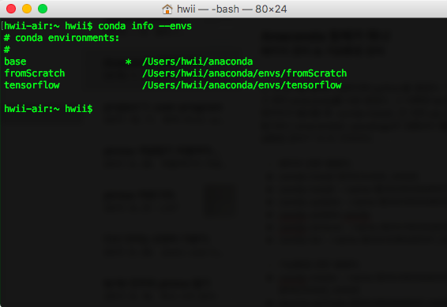
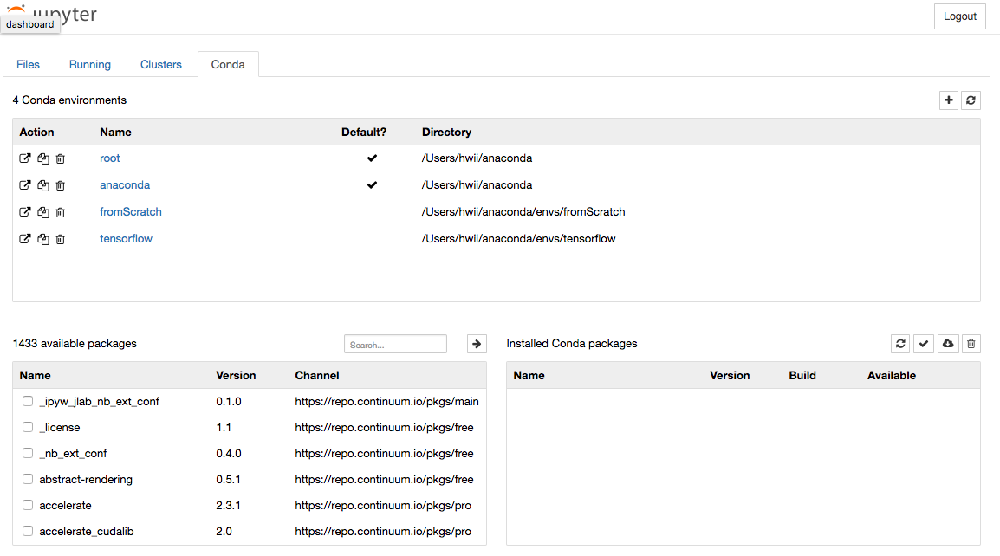

### - 시작
난 내 친구를 통해서 컴퓨터에 python을 깔았다. “이거 다운 받으면 필요한 패키지 다 같이 받아져. 이거 짱이야 이거 받어”라고 하며 anaconda를 다운 받았다. 그 이후엔 terminal에 jupyter notebook 입력해서 나오는 창에서 코딩을 했다. 새로운 패키지가 필요할 땐  conda install, 안 되면 pip install을 쳐서 원하는 패키지를 받을 수 있었다. 
알고보니 anaconda는 여러 pacakage 모아두기보다 훨씬 더 하는 게 많은 툴이었다. 아나콘다의 기능은 **패키지 관리** & **가상환경 관리** 이 두 가지이다.

### - 패키지 관련 명령어
```
conda install $PACKAGE_NAME
conda install --name $ENVIRONMENT_NAME $PACKAGE_NAME
conda update --name $ENVIRONMENT_NAME $PACKAGE_NAME
conda update conda
conda remove --name $ENVIRONMENT_NAME $PACKAGE_NAME
conda list --name $ENVIORNMENT_NAME 
```

### - 가상환경 관련 명령어
```
conda create --name $ENVIRONMENT_NAME python=3.6 $PACKAGE_NAME
source activate $ENVIRONMENT_NAME 
source deactivate
conda env remove --name $ENVIRONMENT_NAME
conda info --envs
```

### - nb_conda라는 jupyer notebook extension
terminal에서 각종 명령어로 하는 가상환경 설정이 어렵다면 이걸 깐다(jupyter notebook extension). jupyter notebook에서 GUI로 가상환경 설정을 할 수 있게끔 해준다. conda install nb_conda 이거 깔면  jupyer notebook에 conda tab이 생긴다.
jupyter notebook에서 새 코드를 작성할 때 new 버튼을 누른다. 이 때 new에 가상환경 리스트가 뜨게 하려면 모든 환경에 conda install notebook 되어 있어야해.

nb_conda 사용 예시
{: width="650px"}
{: width="650px"}

[reference1](http://egloos.zum.com/mataeoh/v/7052271)
[reference2](https://graspthegist.com/post/learn-conda-1/)
[reference3](https://docs.anaconda.com/anaconda/user-guide/tasks/use-jupyter-notebook-extensions)

### - jupyter notebook 홈 디렉토리 변경
jupyter notebook에서 new 버튼을 눌러 코드를 작성하면 홈 디렉토리에 저장된다. 컴퓨터의 최상위 디렉토리에 저장되는 건데 사실 잘 안 쓰는 장소라 파일 찾기 귀찮을 때가 있다. 기본 저장 장소를 바꾸려면 홈 폴더에 있는 숨겨진 파일 .jupyter/jupyter_notebook_config.py 파일을 내용을 바꿔줘야한다. 179번 째 줄 즈음에 있는 #c.Notebook.App.notebook_di= '' 을 수정해준다. 따옴표 안에 원하는 디렉토리를 넣어야겠지?

[reference1](http://luke77.tistory.com/52)

### - 참고
pip install해도 conda 환경 안에 패키지가 설치된다. pip라는 패키지가 conda 환경 안에 있기 때문에!