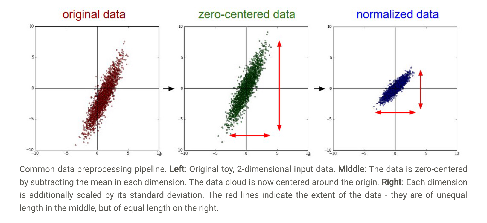
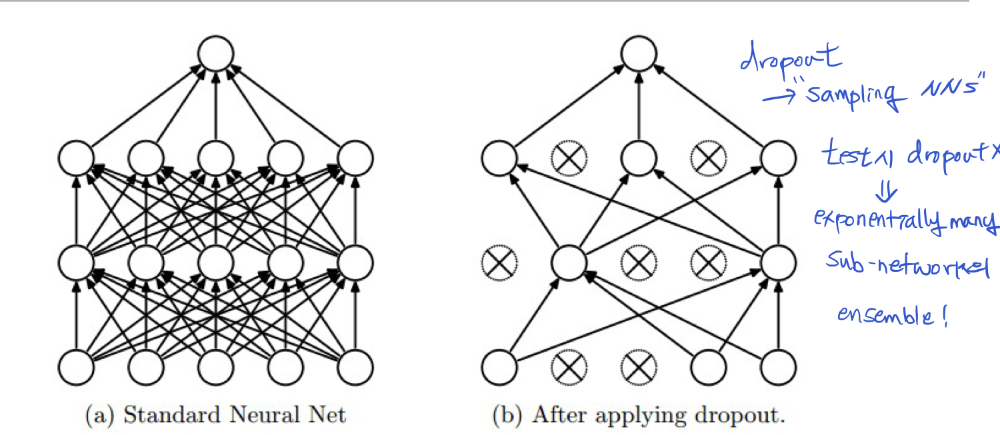
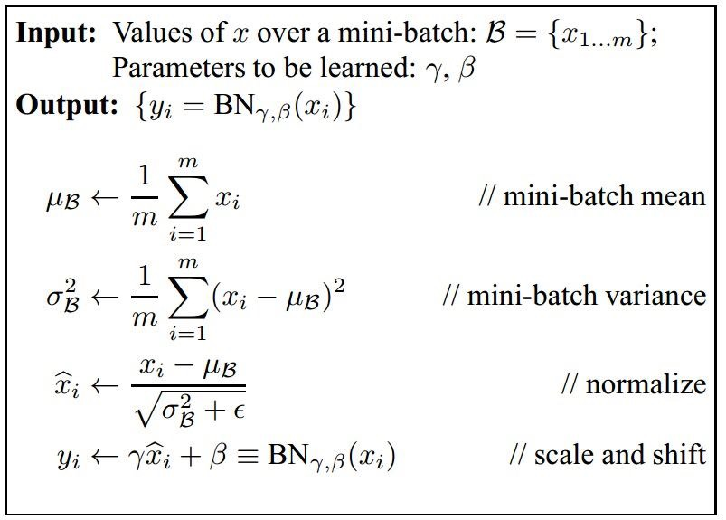

## Machine Learning

#### 1.**<U>차원의 저주에 대해 설명해주세요</U>**

고차원 공간의 data를 다룰 때 나타나는 여러가지 특징을 일컫는 표현.

대표적인 예시로 **차원이 증가하면서 공간의 부피가 너무 빠르게(exponentially) 증가**하는 현상이 있다. 이게 문제가 되는 이유는 데이터 분석을 할 때 우리의 데이터가 공간의 일정 부분을 cover하고 있어야하기 때문이다. 몇 차원 공간이든간에 우리의 data가 공간의 70%는 커버하고 있어야 우리의 분석에 일리가 있는 건데, 고차원 공간에서 70%를 커버하는 데이터를 구하기란 쉽지 않다.


위 예시에서 차원이 증가하면서 25% 공간을 점유하기 위해 필요한 점의 개수는 1개, 4개, 16개, ... 이런 식으로 **지수적으로 증가**한다.  

<br>

#### 2. <U>Data Preprocessing에 대해서 말해주세요. Normalization은 뭐고 왜 하나요?</U>

학습 알고리즘이 원만하게 돌아가기 위해서 data preprocessing을 한다.

대표적인 예시로 normalization이 있다. 각 feature들을 Z score로 바꾸는 과정이다(평균 빼고 표준편차로 나누기). 이걸 하는 이유는 1) feature 값이 원점 주위에 분포되도록 해서(zero centered), non linearity의 input(Wx)이 0에서 너무 멀어지지 않도록 조정해준다. Sigmoid나 Tanh처럼 saturation problem을 가지는 경우, activation function의 input이 극단값으로 가면 backprop시 gradient가 소멸되는 문제가 발생한다. 2) 또 하나의 역할은 모든 feature의 중요도를 동일하게 보기 위해서다. 모든 feature들이 동일한 range에 있도록 scaling을 함으로써. 

3) 모든 feature가 비슷한 범위를 가진다면 error surface가 **타원이 아닌 원형**이 된다. 원형 error surface일 경우 minimum으로 수렴하는 **속도가 더 빠르다**. 


이미지의 경우 RGB값은 각각 0~255의 범위를 가지므로, 표준편차로 나눠주는 과정은 생략해도 된다. RGB의 표준편차는 대략 비슷할 테니까!

CNN을 통한 이미지 처리의 핵심은 이미지의 구조적 정보를 유지하는 거다. 그러니까 구조적 정보를 흐트러트리는 PCA, whitening은 CNN의 전처리로 쓰이지 않는다.

주의할 점! preprocessing statistics는 **training data**가지고서만 계산해야한다! image mean이란 것도 training image mean을 말하는 거다. Test할 때엔 test이미지에 training image mean을 빼는 방식으로 전처리를 해야한다.

- TODO: 이유1)이 맞나?, PCA, whitening

<br>

#### 3. <U>Weight initialization이 왜 중요하고 어떤 방법이 있나요?</U> 

뉴럴 네트워크 학습시 초기 W값을 잘못 설정하면, 제대로된 학습이 이뤄지지 않을 수 있다. 가령, 모든 weight를 0으로 설정한다면 hidden layer 모든 뉴런의 input은 같은 값을 갖게 된다. 이렇게 되면 backprop시 같은 gradient를 갖게 되며, 전체적으로 learning이 이뤄지지 않는다고 할 수 있다. **Symmetry breaking**을 위해서 randomness를 도입, 0 주위의 난수(zero mean unit standard deviation gaussian * small number)로 초기화하는 게 일반적이다. Backprop시 gradient는 W의  값들에 비례하기 때문에, 너무 작은 값으로 초기화할 경우 deep network에서 문제가 발생할 수 있다.

이 방법의 문제는 number of input이 많아질수록 neuron output값들의 분포에서 variance가 커진다는 거! 처음에 variance크게 하려고 randomness 도입했으나, 너무 커진면 또 문제가 되니. 이에 대한 해결방법으로 몇 가지가 있다.

```
# To make variance of each neuron 1
W = np.random.randn(n) / sqrt(n)

# Use this for ReLU, in practice
# variance of each output = 2.0/n
W = np.random.rand(n) * sqrt(2.0/n)

```

Bias는 0으로 초기화하는 게 일반적이다. Weight initialization을 통해 symmetry breaking했으니 문제 없다!

Batch Normalization(주로 Fully connected 혹은 Conv layer 이후, activation 이전)을 사용할 경우 neuron의 input 을 가우시안 분포따르게 해주는 작업이므로, weight init이 잘못 됐더라도 얘가 해결해줄 수 있다.


#### <U>4. Dropout?</U>

Overfitting을 방지하기 위해서 사용한다. 하이퍼파라미터 p로 뉴런이 activate되는 정도를 제어하는 방식으로 작동한다. p=0.5일 경우 해당 레이어 전체 뉴런의 절반만 활성화하는 방식이다. 이러한 방식은 전체 네트워크의 일부분을 샘플링해서 subnetwork를 구성하고, 그에 대한 파라미터만 업데이트하는 흐름으로 이해할 수 있다(물론 exponentially 많은 subnetwork들이 독립은 아니다. 파라미터가 중복되니까.) 테스트 할 때는 dropout을 사용하지 않는데, 이는 많은 sub-network들의 결과를 ensemble하는 방식으로 이해할 수 있다. 

조심해야할 것: 테스트 시 드롭아웃을 적용하지 않기 & test data의 스케일을 조정해주기, *p 만큼. 그래야 각 뉴런이 training time에 만든 output의 기대값과 test time output의 기대값이 같아진다. test data를 직접 건들지 않기 위해, 코드의 확장성(dropout 쉽게 껐다 키기)을 위해서 구현시 **inverted dropout**을 주로 사용한다. Test data에 *p scaling을 해주는 대신 training data에 /p 스케일링을 해주는 것!




#### 5. Batch Normalization

뉴럴넷 학습의 문제점 중 하나는 **weight initialize**를 어떻게 하냐에 따라 학습이 잘 될 수도, 안 될 수도 있다는 것. Initial weight이 너무 작아도, 너무 커도 학습이 일어나지 않으며 이에 대처하기 위해 Xavier initialization등등이 나와있다.

Batch Normalization의 역할은 non-linearity의 input을 normalize하는 것. 그래야 gradient flow가 잘 일어나도록 할 수 있으니. 주의할 점은 **training example의 각 feature**에 대한 평균과 분산을 고려해서 normalize해주는 것. Bad initialization을 잡아주는 효과가 있다. 이후 감마, 베타 파라미터를 도입해 적절 normalize 정도를 학습 과정에 포함시킨다. 

부수적인 효과로 더 큰 learning rate를 가능하게 하는 점과, 일종의 regularization으로 작용한다는 게 있다. 

Test time에 적용하는 mean, variance는 training에서 계산된 값을 이용한다!



