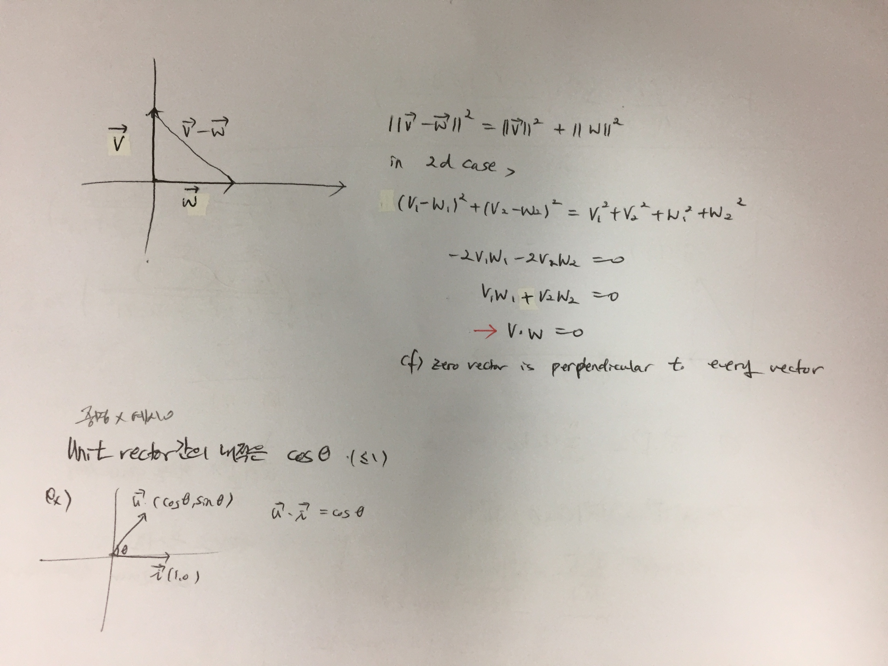

From Introduction to Linear Algebra(Gilbert Strang), [위키독스](https://wikidocs.net/6957).

 

### 궁금했던 것들

1. 두 벡터가 수직이면 내적이 0이다. 왜?

   - 이건 증명이 가능하다.

   $$
   ||\vec{v}-\vec{w}||^2 = ||\vec{v}||^2 + ||\vec{w}||^2 \\
   (v1-w1)^2 + (v2-w2)^2 = (v1^2 + v2^2) + (w1^2 + w2^2) \\
   -2v1w1 -2v2w2 = 0 \\
   v1w1 + v2w2 =0 \\
   \therefore \vec{v} \cdot \vec{w} =  0 \: when \:  \vec{v} \: and \: \vec{w} \: \text{are perpendicular}
   $$

 

2. 두 벡터의 내적이 최대가 되는 건 왜 두 벡터가 같을 때?

- 벡터의 내적 정의를 조금 바꿔보면 

$$
\vec{a} \cdot \vec{b}  = |a| cos\theta \cdot |b|
$$

$$
\text{dot product is maximum when} \\
|\vec{a}|cos\theta \text{ is longest!}
$$

 

3. 벡터 내적과 코사인이 어떻게 연결되는지

- 이건 증명보다는 예시를 통해 이해하는 방향으로 가자..

$$
\text{inner product of two unit vectors is the cosine of } \theta \\
\theta = \text{angle between two vectors} \\
\frac{\vec{a} \cdot \vec{b}}{|\vec{a}| \cdot |\vec{b}|} = cos\theta  \\
\text{inner product of two NORMALIZED vectors!}
$$

 

4. 벡터 내적과 상관계수가 어떻게 연결되는지?

	- 상관계수는 두 벡터의 사잇각으로 표현된다

$$
\vec{x} = [x_1, x_2, \dots, x_n] \\
\vec{y}= [{y_1, y_2, \dots, y_n}] \\
\text{data points} = (x_i, y_i) \\

\text {two  vectors }\vec{a} \:and\: \vec{b} \\
\vec{a} = \vec{x} - \bar{x} \\
\vec{b} = \vec{y} - \bar{y} \\

\frac{\vec{a} \cdot \vec{b}}{|\vec{a}| \cdot |\vec{b}|} = cos\theta =  r\text{ (correlation coefficient)}
$$
