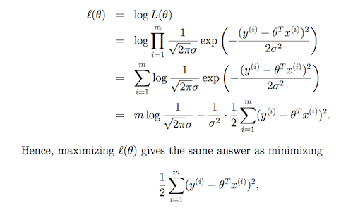

From Neural Network Design, CS229 lecture note, 문일철 강의

# Training Neural Network  - in Bayesian Statistical Framework

베이지안 관점으로 뉴럴 네트워크를 표현하면 다음과 같은 장점이 있기에 이 작업을 한다  

>  장점 1. prior knowledge를 반영할 수 있다. 즉, 뉴럴넷의 weight는 이럴 것이다!라는 정보를 수식에 반영할 수 있다.
>
>  장점 2. 최적 regularization 강도를 결정할 수 있다. 즉, $\lambda$값을 주먹구구식으로 찾지 않아도 된다.

 

뉴럴넷을 학습하는 과정을 베이지안 관점에서 표현하기 위해선 몇 가지 **가정**이 필요하다.

>  가정 1. 네트워크의 weight는 확률 변수이다. 그리고 **weight는 정규분포를 따른다**. *베이지안이 아닌 관점에서는 weight를 확률 변수로 보지 않는다는 점에 유의하자!*
>
>  가정 2. **데이터의 오차는 정규분포를 따른다**. $Y = F(x) + \epsilon$ 이라고 할 때, $\epsilon \text{~} N(0, \sigma^2)$이다. *여기서 $F(x)$는 우리가 만들어내는 함수가 아니라 근사하고자 하는 미지의 true function임에 유의하자.*

아래서 전개할 내용은 위의 가정들이 성립할 때만! 유효하다는 걸 명심해두자. 단순한 결과는 이러한 가정이 있기에 가능한 것이다.

 

가정을 했으니 뉴럴네트워크 학습 과정을  다음과 같이 수학적으로 표현할 수 있다.

$$\arg\max_\mathbf{w}  P(w|D,\alpha, \beta, M) = \frac  {P(D|\mathbf{w},\beta,M)P(\mathbf{w}|\alpha,M)}{P(D|\alpha, \beta, M)} \\$$

$$
\begin{align}
w: weights\\
D: \text{Train data}\\
M: \text{selected model }\\
\alpha: \text{see below }\\
\beta: \text{see below}
\end{align}
$$

등식의 좌항을 말로 표현하면 이렇다. 학습 데이터(D)와 모델(M)이 주어졌을 때, 가장 확률이 높은 weight를 찾자!(가정 1에 따라 weight를 확률적으로 표현할 수 있다.) 좌항의 이름은 **Posterior density function**이다. 데이터가 주어진 후에 weight를 고려하니까 posterior라고 말한다.

베이지안 관점을 적용한다는 것은 좌항을 우항으로 표현한다는 것을 의미한다. 우항은 P( )꼴로 생긴 3개의 항으로 이루어져있는데, 각각의 값들을 살펴보자.

 

1. $P(D\|\mathbf{w},\beta,M)$: weight와 모델(M)이 주어졌을 때 D의 확률밀도함수, 즉 **likelihood function**.

   가정 2에서 오차$\epsilon$의 정규분포를 가정했으므로 likelihood funciton은 정규분포를 따른다(~~믿음으로 극복~~).

   ​
	
   $$
   \begin{align}
   P(D\|\mathbf{w},\beta,M) = \frac{1}{\sqrt{(2\pi\sigma_e^2)^n}}\exp{(-\frac{E_D}{2\sigma_e^2})} \\
   = \frac{1}{Z_D(\beta)}\exp{(-\beta E_D)}
   \end{align}
   $$
   
   
   앞서 밝히지 않은 $\beta$의 정체가 여기있다. $P(D\|\mathbf{w},\beta,M)$이라는 정규분포에서 표준편차를 포함하는 부분을 치환한 것이다. 

   $$
   \begin{align}
   \beta = \frac{1}{2\sigma_e^2}\
   \end{align}
   $$

   이때 한 가지 흥미로운 점은, 주어진 likelihood function을 최대화하는 weight를 찾는다는 것은 (=MLE를 하면) 곧 squared error를 최소화하는 weight를 찾는다는 것과 동일하다는 점이다. 뉴럴네트워크 등에서 목적 함수를 squared error를 사용하는 데는 이러한 이론적 바탕이 있다. 

      
   likelihood function을 최대화하는 weight값을 *most likely* 한 값이라고 부른다.
    

2. $P(\mathbf{w}\|\alpha,M)$:  데이터도 안 보고 얘기할 수 있는 weight의 확률밀도함수. 이걸 **prior density function**이라고 부른다. 데이터에 대한 정보가 없이 weight는 이렇다!라고 얘기하는 부분이니까 prior다. 이 부분은 우리가 **마음대로** 조절할 수 있는 부분이다. 앞서 말했던 장점 1. "weights이럴 것이다!"를 수식적으로 반영하는 부분이 여기다.

   가정 2에서 weight가 평균이 0인 정규분포를 따른다고 했다. 정규분포로 설정하는 데는 세상에 존재하는 많은 값들이 정규 분포를 따르니까 weight도 그렇겠지라는 믿음이 반영되어있다(중심극한정리에 따르면 sample사이즈가 클 경우 weight의 평균은 정규분포를 따른 다는 밑바탕도 있고). 게다가, 정규분포는 두 개의 parameter로 손쉽게 다룰 수 있다는 장점도 있다. 물론 weight가 다른 분포를 따를 것 같다고 생각하면, 다른 분포를 쓰면 되긴 된다.

   

   $$
   P(\mathbf{w}\|\alpha,M) = \frac{1}{(\sqrt{(2\pi\sigma_w^2)^n})}\exp{(-\frac{E_w}{2\sigma_w^2})} \\
   = \frac{1}{Z_W(\alpha)}\exp{(-\alpha E_W)}
   $$
   
>

3. $P(D\|\alpha, \beta, M)$: ~~모델(M)이 주어졌을 때~~ train data(D)의 확률밀도함수. 이 놈의 이름은 evidence이다. 위의 수식에 나와 있듯이, 뉴럴네트워크 학습 과정은 w에 관한 식을 푸는 것이다. 그런데 evidence는 w에 관한 식이 아니다. 즉, 위의 식에서 상수로 취급된다. *나중에 $\alpha, \beta$값을 구할 땐 중요하게 다뤄지긴 하지만.*

 

1,2,3에서 논의한 내용을 정리하면 우항은 $\frac{정규분포 * 정규분포}{상수}$의 꼴로 표현되는데, 이는 곧 새로운 정규분포로 표현된다. 정규분포에 정규분포를 곱하면 정규분포니까. 그런데 이 새로운 정규분포의 모양이 흥미롭다. 

$$
P(w\|D,\alpha, \beta, M) \propto -F(\mathbf{w}) \\
 F(\mathbf{w}) = \alpha E_d + \beta E_w \\
 E_d: \sum(t-a)^T(t-a) \\
 E_w: \sum w^2
$$

이게 흥미로운 이유: 베이지안에 따르면 사후 확률을 최대화하는 w값을 찾는다는 건(MAP) 곧 regularization term을 포함한 목적 함수를 최소화하겠다는 의미랑 같다! 다시 말하면, 우리가 목적 함수에 $\sum \mathbf{x^2}$을 추가해주고 최적화 문제를 푼다는 것은 베이지안 관점에서 MAP을 한다는 걸로 이해할 수 있다는 점!

posterior density function을 최대화하는 weight값을 *most probable*한 값이라고 부른다.

 

여기까지 전개를 하면 **$\alpha, \beta$값을 이해**할 수 있다. $\beta$값을 먼저 보면, 이 값은 error의 분산에 반비례한다. error가 크면 우리에게 주어진 데이터를 마냥 신뢰할 수 없는 상황이다. 그러니까 주어진 데이터에 딱 맞는 함수를 찾으면 안 되는 상황이다. $\beta$ 수식에 따라 error의 분산이 크면 값이 작아지고, 그러면 regularization strength를 크게하는 꼴이 된다. 즉, 주어진 데이터에 딱 맞게 하지 않겠다는 것이다. 

$\alpha$값은 weight의 분산에 반비례한다. weight에 대해 확신할 수 없는 상황이라면 우리의 network의 variation을 최대한 보장해줘야하는 상황이다. weight 분산이 커지면 regularization strength는 작아지고, weight에 대한 제약 조건이 작아진다. 

 

**TODO:**

각각의 데이터 포인트가 정규분포를 따른다는 정확한 증명! notation도 표현해서.
