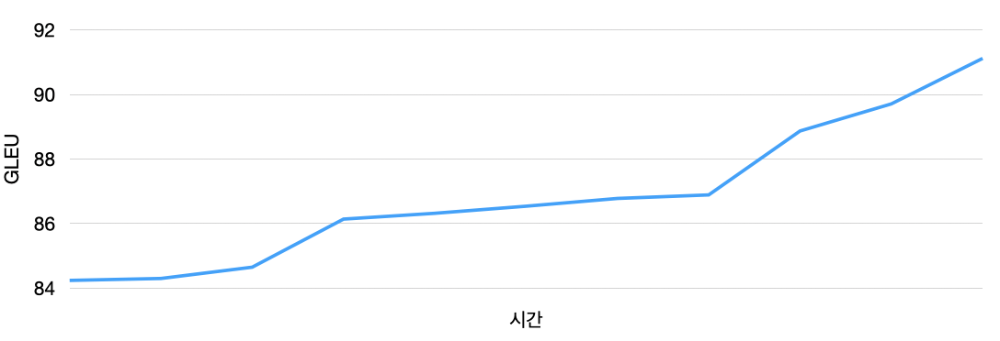
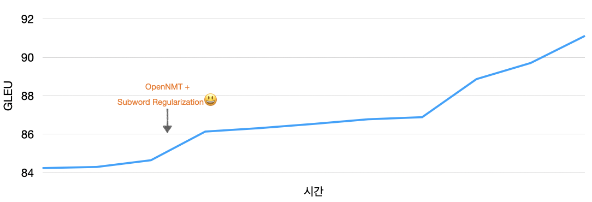
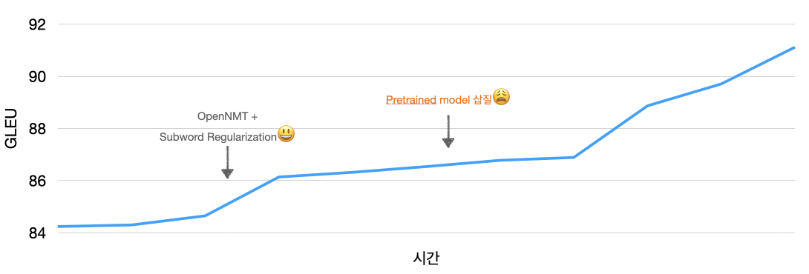

# Naver AI RUSH 2020

Naver에서 기획한 [AI 프로젝트 챌린지](https://campaign.naver.com/airush/)로 7월 13일부터 8월 27일까지 무려 한 달이 넘는 기간동안 진행했다. 제일 먼저 서류 심사 그리고 코딩테스트를 거쳐야 본격적인 AI 과제에 참여할 수 있었다. AI 과제는 1차, 2차로 나누어 진행됐다. 1차는 NLP와 Vision 과제가 하나씩 나왔는데, 각 과제 상위 25명만 2차에 진출할 수 있었다. 2차 과제는 NLP와 Vision 뿐만아니라 Speech, Anomaly detection 등 다양한 주제로 구성되어있었다. 우리 공수래공수거팀은 NLP 전공이다 보니 2차에서 Grammatical error correction와 Spam mail classification 두 가지 과제에 참여했고 **GEC 과제에서 3등**, **Spam 과제에서 1등**을 기록했다. 우리 팀이 GEC 과제에 어떻게 접근했는지, 어떻게 아래와 같은 성능 그래프를 그릴 수 있었는지를 정리해봤다.

## 0. GEC? 

GEC에 대해서 들어본 적은 있지만 실제로 해본 적은 없던 터라 이에 대한 이해가 가장 먼저 필요하다고 생각했다. 첫날 김규완 멘토님이 과제 설명해주신 것을 듣고 적어둔 것들은 아래와 같다.

* GEC는 결국 sequence transduction 문제다. NMT 분야에서 사용하는 테크닉을 사용할 수 있겠다.
* 근데 GEC가 NMT랑 다른 게 뭐지? 이 과제 특징에 따른 공략법이 있을까?
* 언젠가 인터넷에서 [박규병님](https://github.com/Kyubyong)이 문법 교정에 관심이 있다고 하신 걸 본 적이 있다. 그 분 깃헙을 찾아봐야지.
* 한국어 처리를 위한 툴킷 [`KoNLPy`](https://konlpy.org/ko/latest/)와 [`soynlp`](https://github.com/lovit/soynlp)에서 힌트를 얻을 것이 있나 찾아보자.

위 질문들을 붙잡고 고민하고 싶었지만 경진대회 특성상 빠르게 결과물을 내야했기 때문에 고민을 잠시 적어 내려두고 코드를 보기 시작했다.

## 1. Baseline?

멘토님께서 공유해주신 baseline 코드는 transformer 기반의 seq2seq 모델이었다. 코드를 이해하기도 전에 우선 돌리고, `submit`까지 해봤다. 결과는 GLEU`83.44`점이었다. 코드가 정상적으로 돌아간 다는 데 안심을 하고, 이 코드 베이스를 사용한다면 바로 개선할 수 있는 부분이 뭐가 있는지를 파악해봤다.

* *Tokenization:* character 단위에서 subword 단위로 바꾸면 UNK word 문제 해결에 도움이 되지 않을까? 덤으로 [subword regularization](https://arxiv.org/abs/1804.10959)도 적용해볼 수 있겠다.
* *Copy mechanism*: 문법 오류가 있는 몇 부분을 제외하고는 원문과 동일하니 효과가 있지 않을까?
* *Decoding*:  Greedy search를 beam search로 바꾸면 이건 무조건 성능이 오르겠다. Coverage penalty, length penalty 등의 방법도 성능향상에 도움이 될 수도?
* *Ensemble*: 모델 앙상블도 무조건 성능이 오르는 포인트겠다.

여기까지 생각을 하고 바로 tokenizer 교체 작업에 착수했다. **Subword 단위로 바꾸고, subword regularization을 적용하니 `83.44`에서 `84.91`으로 성능이 올랐다.**

> Tokenizer을 바꾸는 작업이 생각보다 까다로웠다.  `sentencepiece`을 이용했는데, 파이썬 포트를 사용하지 않고 C++ 소스로부터 `build`해서 사용한 게 화근이었다. 찾아보니 `NSML`은 도커 기반으로 환경을 설정한대서 `sentencepiece`가 설치된 이미지를 만들고, docker hub로 `push`한 뒤, `NSML`이 그 이미지를 `pull`해서 사용하도록 `setup.py`를 설정해줘야했다. 
>
> 또 하나 시간이 많이 든 건 `NSML`의 `save`, `load` 로직을 이해하는 것이었다. `sentencepiece`는 데이터로 부터 tokenizer 모델을 훈련하고 이를 바이너리 파일로 저장한다. 한편 `NSML`을 사용하려면 `save`를 필수적으로 정의해줘야한다. `sentencepiece`도 파일을 저장하고, `NSML`도 파일을 저장하니까... 아니 그러니까 둘 다 저장을 하네? 뭐지? 라고 헷갈리기 시작했다. `NSML`의 `save`는 저장이라기보단 `NSML`이 지정해준 특정 위치(`/tmp` 아래 어딘가)에 파일을 두기만 하면 다른 세션(`submit` 세션 등)에서 불러(`load`)올 수 있다는 걸 이해하니까 문제가 풀렸다. `sentencepiece`가 저장하는 파일을 `NSML`이 지정해준 위치에 옮겨두면 되겠구나. `subprocess` 모듈을 이용해서 파이썬 내부에서 쉘 명령어 `mv`를 사용하는 걸 `save`함수로 정의하면 되겠다. 이 간단한 걸  파악하는데 생각보다 오랜 시간이 들었다.

`Docker`, `NSML` 과 씨름하느라 시간을 꽤 보내고 나니 subword tokenization + subword regularization만 한 채로 1주차가 마무리 됐다. 리더보드 2등이었고, 이때부터 다른 팀은 무슨 방법으로 점수를 높인 걸까 궁금증이 끊이지 않았다.

## 2. OpenNMT as baseline

처음에 생각했던 네 가지 중에 하나를 구현하는데 1주일이 걸리고 보니 이런 전략으로는 안되겠다 싶었다. 경진대회 특성상 구현 이후에도 튜닝을 하는 데 시간을 많이 쏟아야한다는 생각이 들면서 **generation toolkit을 사용해야겠다**는 생각이 강하게 들었다. 예전에 Marcin Junczys-Dowmunt가 [practical NMT](http://www.phontron.com/class/mtandseq2seq2019/schedule/practical.html)라는 주제로 발표한 걸 들은 적이 있는데, 거기서 그 분이 그랬다. Generation toolkit하나를 정하고, 내부 코드까지 속속들이 파악하고 있으라고 (그래서 그 분은 그냥 `MarianNMT`를 직접 만드셨고 빠삭히 알고 계신단다ㅎ). 나는 예전에 data-to-text generation 프로젝트를 하면서 [`OpenNMT`](https://github.com/OpenNMT/OpenNMT-py)를 세세하게 본 경험이 있던 터라 이걸 사용하기로 했다. 대안으로는 [Fairseq](https://github.com/pytorch/fairseq)이 있었는데, 쓱 보니 `OpenNMT`와 비슷하지만 최신 기능(?)들이 더 많이 구현되어있는듯 했다. 이걸 파악하는 데 시간을 더 쓸 수 없던지라 깔끔하게 포기했다. 그러고는 지금까지 구현해둔 transformer + subword regularization을 `OpenNMT` 기반으로 다시 구현했다.

> OpenNMT 를 `NSML`에서 실행할 때 두 가지 선택지가 있었다. 첫 째는 파이썬 코드에서 `OpenNMT` 라이브러리를 불러와서 사용하는 것이고 둘 째는 파이썬 코드 하나 없이 쉘에서 바이너리 실행 파일을 돌리는 것. 첫 째 방법을 한다면 파이썬 코드를 수정하면서 좀 더 유연하게 조작할 수 있겠지만, 그럴 일이 없을 것 같아서 더 빨리할 수 있는 두 번째 방법을 택했다. `sentencepiece` 를 이식하며 `NSML`과 씨름했던 터라 `NSML`에서 `subprocess` 모듈을 이용해서 `OpenNMT` 바이너리를 실행하는 건 어렵지 않았다. 그런데 하나 생각 못했던 것이, 실행 인자들이다. `NSML`로 넘긴 인자들을 `OpenNMT`로 넘겨주기 위해서 중간 다리 역할를 만드느라 애먹었다. 하나도 빼먹으면 안 됐기에 꼼꼼히 하느라. 디지털 바느질을 하는 느낌이었다. 여기까지 하니 내 코드는 파이썬이라기보다는 쉘 스크립트가 되어있었다.
>
> Subword regularization을 `OpenNMT`와 같이 사용하는 것도 편법을 사용해야만했다. Subword regularization을 하기 위해선 tokenization을 on-the-fly 방식으로 해야하는데, `OpenNMT`는 효율성을 위해 미리 데이터를 tokenize 및 binarize해서 저장해두고 이후에 이 파일을 불러와서 훈련을 한다. 그러니까 on-the-fly tokenization을 지원하지 않는다는 말이다. 이를 해결하기 위해  `OpenNMT`의 `shard`기능을 편법으로 사용했다. 원래는 메모리 부담을 줄이기 위해 크기가 큰 데이터를 여러 조각으로 나눠서 저장하고, 차례차례 불러와서 훈련하는 기능이다. 각 `shard`를 동일한 데이터로 구성하되, tokenization만 바꾼다면 on-the-fly tokenization과 동일한 기능을 낼 수 있다. 단점은 저장 공간을 더 많이 차지한다는 것. [OpenNMT forum](https://forum.opennmt.net/t/how-to-train-nmt-model-with-subword-regularization-sampling-segmentation-every-epoch/3052/5)에서 이 힌트를 얻고 구현을 했다.

**우여곡절 끝에 `OpenNMT`를 `NSML`위에 올리고 나니 갑자기 할 수 있는 게 많아졌다.** Copy mechanism도 인자 하나로 끄고 켤 수 있었으며, 모델도 transformer에 국한될 필요 없이 rnn, cnn등 다양하게 사용할 수 있었다. 약간의 튜닝을 거치고 나니 `86.14`의 성능으로 리더보드 1등에 오를 수 있었다! 이제 오지게 튜닝만 하면 이 자리를 유지할 수 있겠구나라는 헛된 생각을 했던 게 기억난다.

## 3. Pretrained model?

`OpenNMT`기반 베이스라인을 구축해 두니 다시 고민이라는 걸 할 여유가 생겼다. **대회 기간이 반 이상 지난 시점에 돼서야 나는 논문과 인터넷을 찾아보기 시작**했다. 구글 에서 찾은 자료([1](https://www.kakaobrain.com/blog/65), [2](https://arxiv.org/abs/1903.00138), [3](http://kiise.or.kr/e_journal/2018/6/KTCP/pdf/05.pdf))들을 보니 copy mechanism이 핵심적임을 알게됐고, BART와 같은 DAE기반 pretrained model을 많이들 사용한다는 것을 추가로 알게됐다. 이렇게 평화롭게 아이디어 쇼핑을 하던 와중에 다른 팀이 치고 올라왔다! 

**`89.62`라는 점수를 보고 너무 놀랐다.** 순위가 왔다 갔다 할 거라고 예상은 했지만 이렇게 3점씩이나 차이를 낼 거라곤 생각도 못했다. 아니 어떻게? 아니 3점을? 아니.. 팀원과 이런 대화를 하다가 돌파구를 찾으려면 **pretrained 모델을 사용하거나 data augmentation을 해야한다**는 결론이 났다. 요즘 NLP는 pretrained model이 대세인데 그걸 안 썼다니라는 얄팍한 생각이 들면서 이걸 먼저 시도해보기로 했다. Pretrained model 새로 만드는 건 무리라고 스스로 한계를 지어버려서.. 우리는 가용한 모델이 뭐가 있을까부터 조사했다.

* Bert2bert with `HuggingFace`
* [(Distill)KoBERT ](https://github.com/monologg/DistilKoBERT), [KoGPT2](https://www.google.com/url?sa=t&rct=j&q=&esrc=s&source=web&cd=&ved=2ahUKEwjJmKzlgcfrAhUmyIsBHb1dDe0QFjAAegQIBBAB&url=https%3A%2F%2Fgithub.com%2FSKT-AI%2FKoGPT2&usg=AOvVaw0Lq1eVUgqR-3eQL5uCegXq), [KoELECTRA](https://github.com/monologg/KoELECTRA)
* [mBART](https://github.com/pytorch/fairseq/tree/master/examples/mbart) 

한국어를 지원하는  pretrained 모델은 이 정도가 있는 것 같았고 이런 모델을 어떤 라이브러리 위에서 사용할지 결정해야했다.

1. 라이브러리 없이 간다
2. `HuggingFace`(`EncDecModel` ): Bert2Bert등의 모델 구성 가능
3. `Fairseq`: mBART fine-tune가능
4. `OpenNMT`: Transformer 인코더의 웨이트를 pretrained 모델로부터 수동으로 복사해오면 Bert2RandDecoder 구성 가능

이 중에서 성능 싸움에 유리한 게 뭘까 고민을 해보니 1은 품이 너무 많이 들 것 같아서 빼버렸다. 2, 3, 4는 우열을 가릴 수 없어서 **다 해보기**로 했다. 이 (결과적으로) **잘못된 선택을 하게 돼서 우리팀은 일주일 정도의 시간을 삽질**에 매달리게 된다.

> `HuggingFace`에서 지원하는 `EncDecModel` 은 아직 실험적인 단계라 모든 모델을 다 사용할 수 없었다. 디코더에는 vocab 개수가 KoBERT(8002) 보다 큰 KoGPT2를 사용하고 싶었는데, GPT2 계열의 모델은 아직은 디코더로 사용할 수 없었다. 안 될 이유는 없지만 아직 이걸 지원하는 구현이 없는 상황이었다.
>
> `HuggingFace`에서 `Bert2Bert`를 돌리는 코드는 [여기](https://huggingface.co/patrickvonplaten/bert2bert-cnn_dailymail-fp16)서 시작했다. 데이터 로딩부터 모델, 훈련까지 전부 `HuggingFace`라이브러리를 사용하는 코드였다. 모델만 지원하는 라이브러리인줄 알았는데 이렇게 전범위를 커버하는 라이브러리인지 처음 알게됐다. 문제는 이러한 기능들이 아직  배포단계가 아니어서 `master` 브랜치가 아닌 `dev` 브랜치에 구현되어있다는 점이었다. `dev` 브랜치에 있는 코드를 `NSML`에서 돌려야하니까... 또 Docker 이미지를 구워야했다. `HuggingFace` 소스 코드를 다운 받고, dev 브랜치로 `checkout`한 뒤, 그 걸 `COPY`해서 이미지에 넣고, 허브에 `push`하고, `setup.py`를 수정해주고... 또 환경 셋팅에 시간이 많이 들어가니까 초조해졌다.
>
> `OpenNMT`의 인코더에 KoBERT 웨이트를 수동으로 복사해오는 건 정말정말 노가다였다. 노가다를 마다하지 않을만큼 절실했었나보다. 우선 KoBERT가 사용하는 하이퍼파라미터를 똑같이 가져온 뒤 그걸 사용해서 `OpenNMT` transformer 모델 인스턴스(껍데기)를 만든다. 그 이후에 `OpenNMT` 모델과 KoBERT의 `named_parameter`를 살펴보면서 서로 짝이 맞는 걸 딕셔너리로 저장한다. 그 이후에 만들어둔 `OpenNMT`모델 인스턴스(껍데기)에 KoBERT 웨이트(알맹이)를 집어넣는다. 두 모델의 웨이트는 결국엔 `torch.nn.Parameter`니까 `shape`만 맞으면 이런 노가다가 가능했다.

**삽질의 결과는 보람차지 않았다**. 86정도 되던 dev set 성능이 82정도로 오히려 떨어졌다. 아무도 나를 배신한적 없는데 배신당한 느낌이었다. 멘탈을 잡고 pretrain 마법에도 성능이 오르지 않는 이유를 생각해봤다. 데이터, **훈련 데이터 크기가 너무 작다**.  Generation task를 하는데 훈련 데이터 크기가 2만개 남짓이었다. 그러고 보니 훈련 데이터에 대해서는 accuracy(glue와 다르게 unigram만 봄)가 100에 육박했다. **아, overfitting 이구나** 싶었다. 이런 상황에서 엄청 큰 Pretrained model을 가져다 썼으니 더더욱 overfitting된 거구나 싶었다. 대회 마감까지는 일주일도 안 남았다는데 멘탈이 조금 흔들렸다. 그래도 명확한 문제를 발견했으니 다음 스텝은 뚜렷하게 보였다. 힘을 내고 overfitting 잡기 위한 backtranslation을 시도해보기로 했다.

(2편에 마저 썼습니다.)