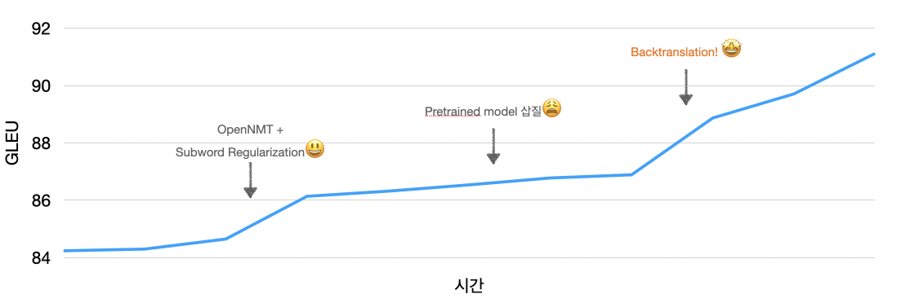
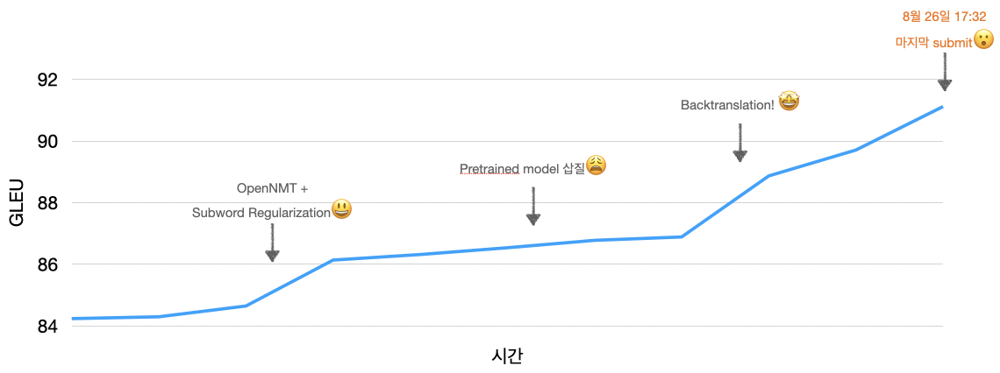

# Naver AI RUSH 2020

(1편에 이은 후기입니다.)

## 4. Backtranslation (with noise)!

남은 시간이 많지않아 이제 부터는 **코딩을 시작하기 전에 계획을 잘 세워서 시간 관리**를 해야했다. Backtranslation도 디테일이 많을테니까, 그런 것들을 조사하기 시작했다. Backtranslation [원 논문](https://arxiv.org/pdf/1511.06709.pdf)과 이를 [분석한 논문](https://arxiv.org/pdf/1808.09381.pdf), [블로그 포스트](https://dev-sngwn.github.io/2020-01-07-back-translation/)를 참고했다. 내가 정해야할 것들을 리스트업 해보니 아래와 같았다.

* Backtranslation 모델로는 뭘 사용할 것인가?
* 어떤 데이터를 monolingual 타겟 데이터로 쓸 것인가?
* Bitext(제공된 parallel 데이터)와 synthetic 데이터의 비율은 어떻게 할 것인가? Upsampling을 할 것인가?
* Backtranslation시 노이즈를 어떻게 주입할 것인가?

가장 간단한 것부터 시작해서 효과가 있는 것에 시간을 더 투자하기로 했다.

* 모델은 지금 사용하는 모델과 동일한 transformer모델을 사용하자
* Monolingual 타겟 데이터는 가장 구하기 쉬운 wiki 데이터를 사용하자
* 데이터의 비율은 잘 모르겠으니 어림잡아 1:4, 1:8부터 일단 해보자
* 노이즈는 backtranslation이 효과가 있다면 그 이후에 해보자

>[wikiextractor](https://github.com/attardi/wikiextractor)를 사용해서 한국어 위키 덤프로부터 텍스트를 손쉽게 뽑아낼 수 있었다. 전처리는 monologg님이 KoELECTRA를 개발할 때 사용한 [방법](https://github.com/monologg/KoELECTRA/blob/master/docs/preprocessing.md)을 기반으로 했다. 코드는 공개되어 있지 않아서 정규표현식을 이용해서 구현했는데, [연습사이트](https://regexr.com)가 큰 도움이 됐다. 전처리 후 파일을 훑어 보면서 잘 안 된 부분은 Vim command들을 사용해서 잡아줬다. 갓빔!
>
>Upsampling은 data weighting이라는 이름으로  `OpenNMT`에서 지원해주고 있었다. bitext와 synthetic 데이터의 비율을 고려해서 배치를 구성해주는 기능이었다. 두 데이터를 모두 메모리에 올려야한다는 단점이 있었지만 `NSML`에서 지원해준 V100은 메모리가 32G였기에 문제 없었다. 그런데 우리 실험에선 upsampling을 할 경우 오히려 성능이 떨어져서 최종적으로는 사용하지 않았다.

무슨 데이터를 쓸지, 데이터 비율 등등 임의로 결정해야하는 부분이 많아서 이게 잘 될거라고 확신하기는 힘들었다. 게다가 synthetic 데이터를 추가하면서 dev set 데이터도 synthetic 데이터가 대부분을 구성하게 되서, dev set기준으로 모델 성능을 가늠하기가 어려워졌다 (물론 task 데이터로 dev set을 구성할 순 있었지만 가뜩이나 적은 애를 dev set에 할애하기 아까웠다). `NSML`에서 훈련을 돌려보니 dev set 성능이 62정도 나왔다. `submit`을 안한지 꽤 된 터라 정말 아무 기대 안 하고 `submit`을 해두고 저녁을 먹으러 갔다. 그런데 밥을 먹고 돌아오니 **정말 예상 밖으로 `88.87` 이라는 점수가 나왔다!** 갑자기 아드레날린이 돌면서 투지가 생겼다. 

남은 시간동안 우리는 데이터에 대한 실험하기로 했다. 앞서 언급한 참고 자료로 부터 NMT에서는 backtranslation 데이터를 구성할 때 **양과 다양성, 도메인이 중요**하다는 힌트를 얻었다. GEC에도 동일한 원칙이 적용될 것이라고 가정하고 세 가지를 고려해서 데이터를 수집하고 실험하기 시작했다. 

*Wiki*, *News*: 위키 덤프 말고도 문법이 맞는 문장을 구할 수 있는 곳은 꽤 있었다. 나무 위키도 덤프를 제공하고 있었고, NEWS 데이터도 쉽게 구할 수 있었다. 이것만 해도 몇 천 만 문장을 구할 수 있을 정도로 데이터 양은 많았다. 너무 많은 데이터 중에 양질의 문장을 골라내기 위해 language model을 사용했다. KoGPT2로 각 문장에 대해 language model 확률(=얼마나 문장 같은지)을 부여하고, 위에서 top K를 추려 사용했다. 그런데 이 데이터들은 맞춤법, 이모티콘 사용, 어투 등이 한 눈에 봐도 블로그 데이터(task 데이터)와는 달랐다.

*Blog*: 네이버 블로그 데이터(in domain)를 얻기 위해 Naver Developers에서 제공하는 [API](https://developers.naver.com/docs/search/blog/)를 사용했다. Task data에서 추출한 단어들을 쿼리로 해서 수많은 blog 데이터를 긁어왔다. 그런데 이 문장들은 문법이 틀린 게 부지기수였다. 우리는 (pseudo) parallel 데이터를 얻기하기 위해서 우리  모델을 사용했다. `88.87`정도 나오는 모델이니까 문법을 괜찮게 수정하겠지 생각하면서. 이렇게 만들어낸 데이터는 문장의 예측에 불과하기 때문에 노이즈를 넣어주는 것이 필수적이라고 생각했다.

*Lang8*: 이외에도 [lang8](https://www.google.com/url?sa=t&rct=j&q=&esrc=s&source=web&cd=&ved=2ahUKEwiN5eGctcfrAhVbL6YKHf2KBxkQFjAAegQIAxAB&url=https%3A%2F%2Fsites.google.com%2Fsite%2Fnaistlang8corpora%2F&usg=AOvVaw3Yg6fvn4Qdnx1-sj6ksFlh)에서 제공하는 문법 교정 병렬 데이터를 다운받았다. 그런데 실제 데이터를 보면 아주 지저분해서 도움이 될지 의심스러운 수준이다. 아주 엄격한 전처리를 통해서 그나마 괜찮은 애들 일부만 추출해냈다.

*+ Noise*: 원 논문에서 backtranslation할 때 노이즈를 추가하는 것이 중요하다고 했다. 논문에서는 빔 서치 대신 샘플링 기반 디코딩, 마스킹을 통해 노이즈를 만들어냈다. 우리는 이 방법 뿐만 아니라 GEC에 도움이 될법한 다양한 방법으로 노이즈를 만들어냈다. 위에서 얻은 다양한 종류의 pesudo parllel 데이터 혹은 synthetic 데이터에 대해 grapheme to phoneme([g2pK](https://github.com/Kyubyong/g2pK)), lemmatization([soynlp](https://github.com/lovit/soynlp)), 그리고 임의로 글자를 바꾸거나 지우기 처리를 하는 걸 노이즈로 삼았다. 이 때 무작위하게 하는 게 중요하기 때문에 어떤 문장에 어떤 노이즈를 추가할지, 한 문장 내에서도 어떤 부분에 노이즈를 추가할지 등을 완전 랜덤하게 설정했다.

다양한 데이터를 다 준비한 뒤, task 데이터에 하나씩 추가해가며 실험을 했다. 데이터를 domain, 처리 방식, 사이즈에 따라 여러 단위로 묶어두고 다양한 조합으로 훈련을 했다. 엄청 엄밀하진 못했지만 **데이터 양을 점점 늘려가는 방향**으로, **노이즈를 점점 추가하는 방향**으로, **비슷한 도메인 데이터를 점점 늘려가는 방향**으로 실험을 했다. 이 때부턴 계속 리더보드에 `submit`을 했는데, 할 때마다 성능이 오르는 아주 상쾌한 경험을 했다. 

적정 Synthetic **데이터의 양은 실험적**으로 정할 수밖에 없는 듯했다. 초기 실험에서 1:8보다는 1:4일 때 성능이 더 좋았어서, 1:4 에서 시작해서 조금씩 더해나갔다. 최종적으론 1:6 정도의 비율을 유지했다. **데이터의 양은 도메인과도 관련**이 있는 듯하다. Blog 데이터에 비해 wiki 데이터가 과도하게 많은 상황에선 wiki 데이터를 추가한다고 성능이 더 오르지는 않았다. **노이즈는 추가하는 것이 좋았다**. 특이했던 건 pseudo parallel 데이터에 노이즈를 추가할 때 원래 데이터를 '수정'하는 것보다 원래 데이터를 그대로 두고 노이즈가 추가된 것을 '추가'하는 게 성능이 더 좋았다는 점이다. 

옳은 궤도에 올랐구나 싶었지만 문제는 이미 대회가 막바지에 다다랐다는 것이다. 우리팀은 마지막 날까지도 실험할 게 너무 많아서 `NSML` GPU를 쉬게 두지 않았고, 결국 하고 싶은 게 남은 채로 대회 마무리를 맞게 됐다. 심지어 우리가 대회 마감 28분 전 기록한 성능이 우리의 최고 성능이었으니, 전략/시간 관리에 대한 아쉬움이 들기도 했다. 그래도 우린 상승세에서 대회를 마무리 하게 되었고 상위 팀과 격차도 많이 좁힌 터라, 1등을 하지 않고도 기분 좋게 대회를 마무리 할 수 있었다. 

## 5. Misc 

* 시시한 얘기지만 경진대회에서 engineering은 한 번 더 강조할 필요가 있다. 모델 앙상블은 필수로 생각해야한다. 쉘 스크립트를 잘 짜서 편하게 (랜덤) 하이퍼파라미터 서치를 할 수 있어야 한다. Random seed도 성능에 영향을 미친다.
* 각종 툴에 익숙한 건 엄청난 시간/에너지 절약이다. Docker를 할 줄 몰랐다면 너무나 많은 시간을 환경 설정에 할애했을 것이다. 그 과정에서 멘탈을 잡고 있기란 쉽지 않다. Vim을 잘 못했으면 디지털 바느질이 두 배는 오래 걸렸을 것이다. 정규표현식을 좀 더 잘 했더라면 하루는 더 벌었을 것 같다.
* Pretrain 모델을 직접 구운 팀이 있었다. 그런 스케일은 안 될 거라고 지레짐작했던 걸 반성했다. 
* 코딩하기 전에 조사하고 생각하기. 웹서핑 느낌으로 둘러봤던 것들이 급할 땐 아이디어로 변신했다.