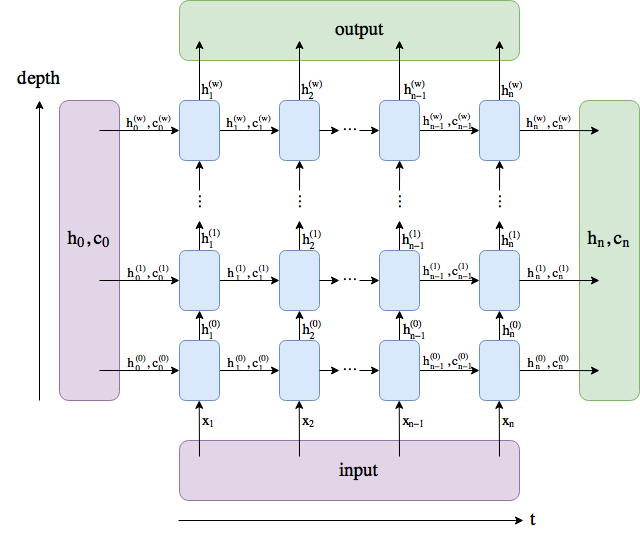

<br>

###  Casting

```python
a = torch.tensor([1,2,3], dtype=torch.float)
a = a.type(torch.long)
```


### Weight Initialization

```python
# nn.module을 상속받은 class 안에서
def weights_init(self):
    for m in self.modules():
        if isinstance(m, nn.Linear):
            nn.init.normal_(mean=0, std=0.1)
```


### torch.nn vs. torch.nn.Functional

중복되는 함수가 꽤 있는 것 같은데, 어디서 무슨 함수를 사용할지는 다음 기준이 좋은 거 같다

- parameter를 갖는 layer의 경우, torch.nn을 사용하고 
- 단순 연산인 경우 torch.nn.Functional을 사용한다

```python
class FC(nn.module):
	def __init__(self):    
	super().__init__()
    self.linear = nn.Linear(30, 20)
    
    def forward(self, input):
        output = F.ReLU(self.linear(input))
        output = F.LogSoftmax(output, dim=1)
        return output
```


### Indexing

```python
# np index과 동일하다
a = torch.randn(3,4)
a_col = a[:,0]
a_row = a[0] # or a[0,:]

b = torch.tensor([3.6])
b_value = b.item()    # python number 3.6
```


### GRU & LSTM input & output

- input: (seq_len, batch, input_size)
  - 예시에서 (1,1,50)
  - seq_len은 한 번에 넣는 input 개수
- hidden : (num_layers*num_directions, batch, hidden_size)
  - 예시에서 (1,1,30)


- output: (seq_len, batch, hidden_size*num_directions)
- h_n: (num_layers*num_directions, batch, hidden_size)


```python
# GRU
gru = nn.GRU(50, 30)    # input_size, hidden_size

inputs = [torch.randn(1,50) for _ in range(5)] 
hidden = torch.randn(1,1,30)

# 방법1
# unrolled version
for i in inputs:
	output, hidden = gru(i.view(1,1,-1), hidden)


# 방법2
# input 여러 개를 한 번에 넣기! 따라서 seq_len을 조정해줘야한다.
output, hidden = gru(torch.cat(inputs).view(len(inputs),1,-1), hidden)
```


[이미지 출처](https://stackoverflow.com/questions/48302810/whats-the-difference-between-hidden-and-output-in-pytorch-lstm?utm_medium=organic&utm_source=google_rich_qa&utm_campaign=google_rich_qa)




- instantiate할 때 인자로 input_size와 hidden_size를 넘긴다.


차이점:

- 함수 *사용시?* GRU는 hidden값을 하나만 받고, LSTM은 두 개를 받는다.

